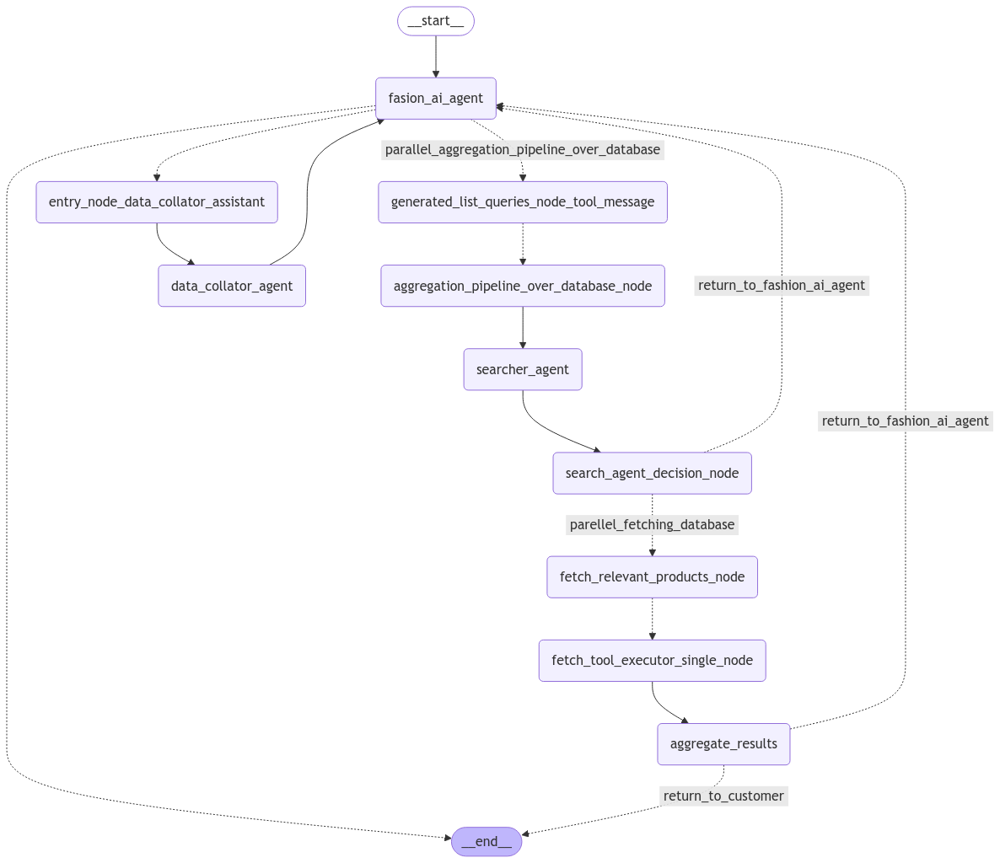

# 🛍️ Multi-Agent AI-Powered E-Commerce Chatbot

## 🚀 Introduction

This **Multi-Agent RAG System** is an advanced AI-powered chatbot designed for e-commerce platforms. It offers **personalized fashion recommendations**, handles **complex shopping queries**, and delivers **real-time business insights** through dynamic analytics dashboards.

## 🔗 **Try it now**: [Multi-Agent Chatbot](https://multi-agent-chatbot-production.up.railway.app/)

## [Watch the video on LinkedIn](https://www.linkedin.com/feed/update/urn:li:activity:7290342858023157760/)
## 

## 🧠 Key Features

### 👗 Personalized AI Stylist
- Upload an image of clothing, and the chatbot analyzes **style, material, and colors**.
- Generates **tailored outfit recommendations** from the store’s inventory.

### 🔍 Intelligent Product Search
- Goes beyond simple keyword filtering by **contextually refining product searches**.
- Uses **parallel aggregation pipelines** to enhance search results with available colors, materials, and pricing.

### 📊 Business Insights & Analytics
- Collects customer preferences and feedback to track purchase likelihood.
- Provides **real-time dashboards** for data-driven decision-making.

## 🏗️ Built with LangGraph

This project leverages **LangGraph**, a powerful tool for orchestrating AI agents:

- **Graph-Based Workflow**: Tasks are structured as **nodes and edges**, allowing for modular and scalable agent interactions.
- **Parallel Execution**: Utilizes **fan-out and fan-in mechanisms** to boost performance.
- **Stateful Orchestration**: Enables context-aware interactions with persistence.

## ⚙️ How It Works

1️⃣ **Supervisor Fashion AI Agent** – Acts as a personal stylist, generating recommendations based on image analysis.
2️⃣ **Searcher Agent** – Contextually refines search results to find the best matches from the store inventory.
3️⃣ **Data Collator Agent** – Monitors customer feedback, analyzes sentiment, and updates analytics dashboards.

## 🛠️ Tech Stack

- **Python** (FastAPI, LangChain, LangGraph)
- **MongoDB** (Customer preference storage & analytics)
- **React** (Frontend UI)
- **Heroku** (Deployment)

## 📢 Try It & Contribute!

We’d love your feedback! Try out the chatbot, and feel free to contribute to the project.

🔗 **Live Demo**: [Multi-Agent Chatbot](https://multi-agent-chatbot-production.up.railway.app/)

💬 Have ideas or suggestions? Let's collaborate!

---

📌 **Author**: [Your Name]  
📧 **Contact**: [Your Email or GitHub Profile]  
🌍 **GitHub Repository**: [Repository Link Here]

